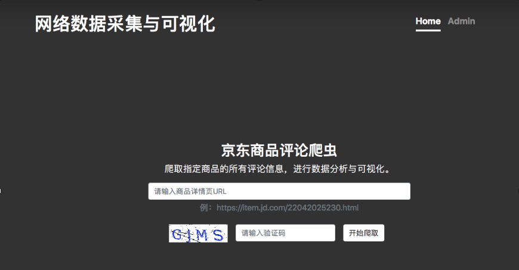
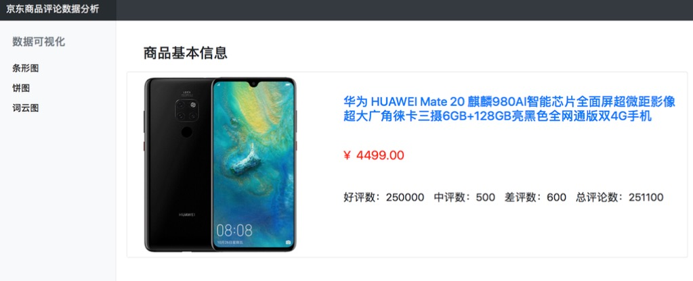
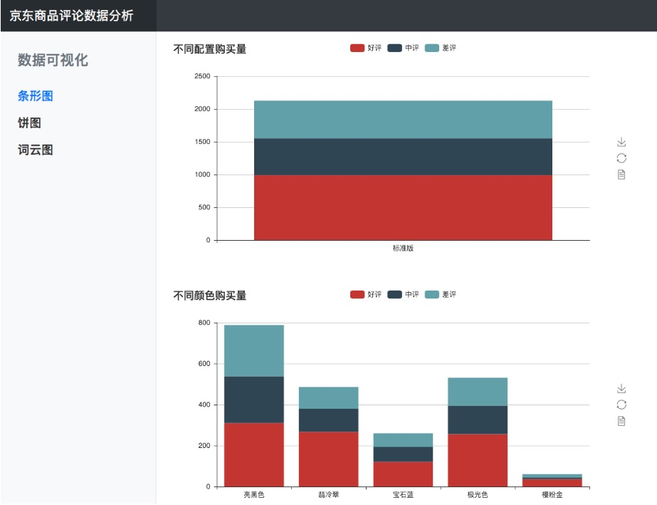
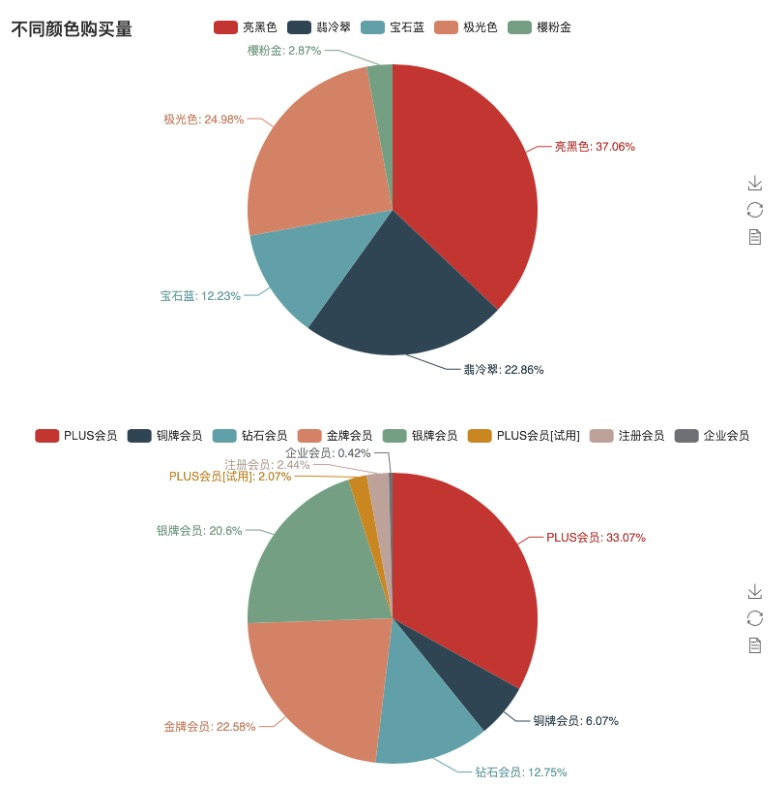
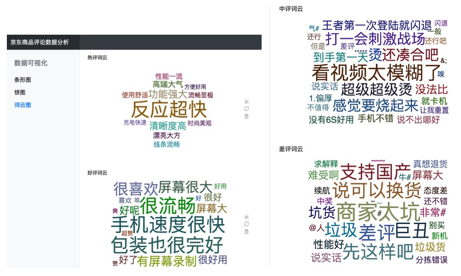
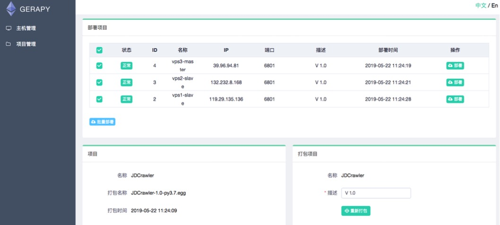
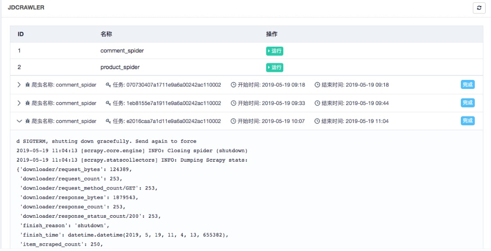

# JD Distributed Crawler and Visualization System

The JD Distributed Crawler and Visualization System (JD-DCVS) is the graduation project of my undergraduate. 

It can crawl comments of given [JD](www.jd.com) goods' url. After that, users can visualize and analyze the data by several statistics charts, such as pie charts, line charts and wordcloud charts, which can help users judge whether the goods are good.

**If you want to crawl other data like weibo, you can reuse most modules in this system.**

## Features

+   **Distributed architecture design**. By sharing the crawl queue, distributed crawlers can dynamically add nodes at any time without downtime, which is extremely scalable. 
+   **Anti-anti-crawler measures**. In order to enable the crawler to cope with common anti-crawler measures, I also designed and implemented an [IP proxy pool](https://github.com/fgksgf/IP-Proxy-Pool) to provide a large number of highly anonymous IP proxies. 
+   **NoSQL storage**. In the case of crawler high concurrent processing, the system uses non-relational database (NoSQL) to store data to improve the efficiency of reading and writing data. 
+   **Node management**. The Gerapy framework provides users with a graphical interface to easily manage and deploy crawler nodes. 
+   **Data visualization**. Use the Pyecharts library to quickly generate crawl data into simple, beautiful, interactive statistical charts.

## Architecture

There are four main modules in the system: 

1.  Distributed crawler module. The code of all crawler nodes is the same and all URLs to be requested are obtained from the same queue. In this way, if the scale of the crawled data is expanded, only the crawler nodes need to be added to meet the demand, which has extremely high scalability.
2.  IP proxy pool module. An IP proxy pool module is designed as an independent node. It contains three sub-modules: proxy getter, proxy tester, and interface module. 
3.  Data storage module. MongoDB is responsible for storing the semi-structured data crawled by the crawler, and Redis is responsible for storing the URL to be crawled and proxy information. 
4.  Web application module. It mainly contains four sub-modules: node management, data processing, data visualization, and adding tasks. The module also acts as an independent node.


## Requirements

+ Python 3.6+
+ [Docker](https://docs.docker.com/install/linux/docker-ce/ubuntu/) and [docker compose](https://docs.docker.com/compose/install/)
+ Mongodb for store crawled data
+ Redis for maintaining the shared crawl queue
+ ~~At least one server with public network IP address for deploying [IP proxy pool](https://github.com/fgksgf/IP-Proxy-Pool)~~

## Configuration

### Mongodb

```bash
# download docker image
$ docker pull mongo

# run image in background 
$ docker run -p 27017:27017 -v /<YourAbsolutePath>/db:/data/db -d mongo
```

### Redis

```bash
# download docker image
$ docker pull redis:alpine

# run image in background and set password
$ docker run -p 6379:6379 -d redis:alpine redis-server --requirepass "password"
```

## Usage

### Informal Usage (Single node)

You can run this project with single node just for test:

1. Complete above configurations to run redis and mongodb docker images.
2. Create a virtual python environment and install requirements.
```bash
$ git clone https://github.com/fgksgf/DCVS.git
$ cd DCVS/
$ pip install -r requirements.txt
```
3. Start a master crawler node, a slave crawler node and the web server.
```bash
$ python jd/start_master.py
$ python jd/start_slave.py
$ python app.py
```
4. Open the brower, enter `http://127.0.0.1:5000/`, input a url of jd goods like `https://item.jd.com/100008578480.html`.


### Formal Usage (More nodes)

## Test

Because APIs may be changed, if you want to check if the jd crawler still works, just run `./jd/util/debug_comment_spider.py` and `./jd/util/debug_product_spider.py`. You would get the answer easily after you see the results.

## Screenshots

+ main page


+ result page


+ visualization






+ node management




## Change Log

### 0.1 (2020-02-11)

+ Update visualization module
+ Update data model
+ Refactor charts code to improve reusability
+ Add more details about configuration and usage
+ Remove CAPTCHA
+ Update page flow
+ Update proxy pool dependency
